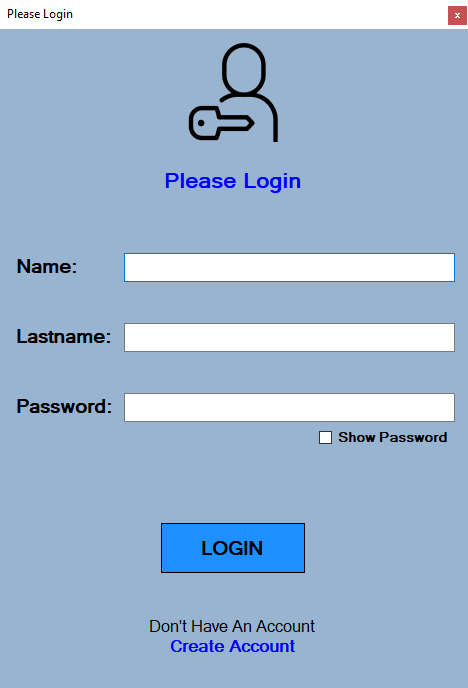
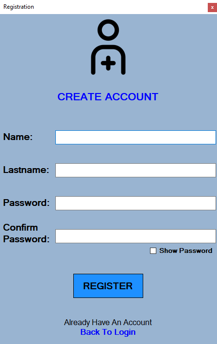
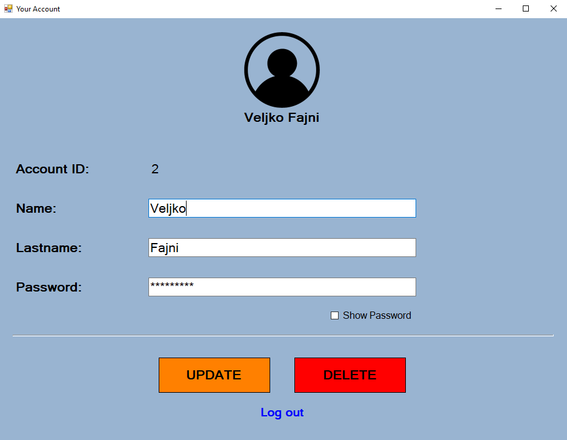
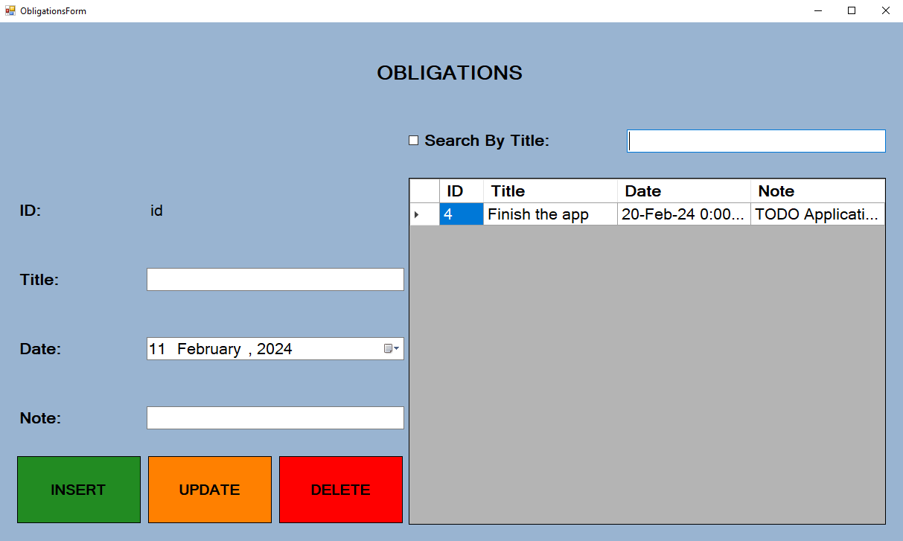

# 📝 ToDo-simple

Simple three-layered CRUD ToDo Application Made In .NET 4.8 Framework Using Windows Forms. Main Idea Is To Track User's Obligations/Tasks. Every Obligation Is Bind To a Specific User.

## Technologies and tools

- .NET Framework 4.8
- Windows Forms
- LocalDB, ADO.NET
- Unit tests

## Project Structure

```
├── source/TODO				# Contains all the source files for application.
│   │
│   ├── BusinessLayer			# Business logic for manipulating data, manage communications between repository and presentation layers.
│   │   ├── UserBusiness.cs
│   │   └── ObligationBusiness.cs
│   │
│   ├── PresentationLayer		# Contains user interface and logic responsible for presenting data to user, as well as user actions.
│   │   ├── Resources			# Contains symbols/images used in presentation layer.
│   │   ├── Program.cs
│   │   ├── LoginForm.cs
│   │   ├── MainForm.cs
│   │   ├── ObligationsForm.cs
│   │   ├── RegistrationForm.cs
│   │   └── UserForm.cs
│   │
│   ├── RepositoryLayer			# Data access layer that contains files for communication with the database.
│   │   ├── UserRepository.cs
│   │   ├── ObligationRepository.cs
│   │   └── Constants.cs		# Contains connection string for database.
│   │
│   ├── Shared				# Folder that contains other content.
│   │   ├── Models			# Available entities.
│   │   ├── Interfaces			
│   │   └── Tables			# Contains SQL files for creating tables and other SQL queries.
│   │
│   └── Tests				# Unit Testing
│
├── ER					# Contains ER diagrams.
│   └── entity-relationship diagram.png
│
└── README.md                   	# Project documentation (you are here!)
```

## Demo images

<details>
<p align = "center">

<br/>

<br/>

<br/>

</p>
</details>

## Project build & My Notes

-  Creating the application: Windows Forms App (.NET Framework)
- Connection with database: View - Sql Server Object Explorer
- Adding new layer: Solutin - Class Library (.NET Framework)
- using new layer: Select the layer - Add - Reference ... Project
- How to find connection string: Properties on database - Connection String - delete all after TrustServer
- Start the application: Solution - Properties - Startup Project: Current selection
- Tests: Unit Test Project (.NET Framework)